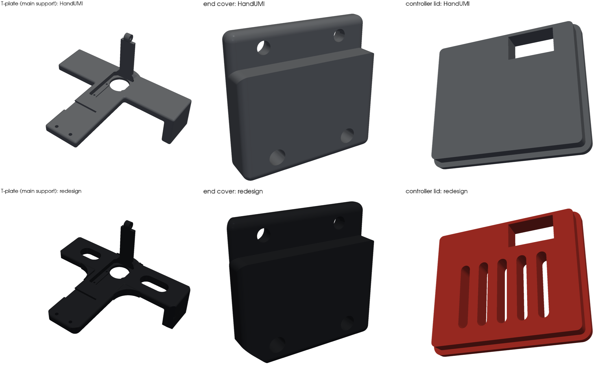

# The UMI no one wants

  

A hand-worn UMI for collecting bimanual manipulation data, built on
[HandUMI](https://github.com/murobotics-ai/handumi-hw). It's HandUMI's mechanism unchanged, with an
**Intel RealSense D405** depth camera on the wrist and a cleaner, redesigned frame.

- **D405 wrist camera:** a cup for the D405 on HandUMI's original camera hinge, so the tilt is adjustable, with cable windows on the top and sides.
- **Redesigned frame:** the T-plate, end cover and controller lid have a new look. Every hole, bore and mating face is the same as HandUMI's, so all other HandUMI parts, tips and the BOM still apply.
- **Checked in a full assembly:** the device above is rebuilt from the part files, and the moving gripper is clash-checked at closed, half-open and open.

## D405 wrist camera

  

- Prints in place of HandUMI's `camera_mount`. The hinge knuckles are copied unchanged from HandUMI, and it pivots on the main support's tab with an M3 bolt. Use a nyloc nut so the angle holds with the 58 g camera.
- The D405 fixes with **2× M3×5** into its rear holes (2× M3×0.5, 20 mm apart, 4 mm max thread depth per Intel's datasheet).
- Cable windows are on the top and both sides.

## Redesigned parts

  

| Part | Replaces (HandUMI) | Changes |
|---|---|---|
| `main_support` | `fisheye_camera_main_support` | Blended arm-to-bar and boss transitions, racetrack lightening slots, rounded arm end, 45° faceted wall and bar-end corners, engraved name |
| `end_cover` | `main_support_cover_plate` | Matching 45° facets |
| `controller_lid` | `servo_controller_cover` | Vent slots |

All three are the same part for left and right hands, as in HandUMI.

## Build

1. Print HandUMI's `hardware/STL/right_handumi/` (or `left_handumi/`), **except** `camera_mount`, `fisheye_camera_main_support`,
   `main_support_cover_plate` and `servo_controller_cover`.
2. Print instead: `hardware/STL/d405/wrist_d405_mount_handumi.stl` and everything in `hardware/STL/redesign/`.
3. Print gripper tips for your robot from `hardware/STL/gripper_tips/`.
4. Buy parts from HandUMI's [BOM](bom/README.md), replacing the IMX335 camera with an **Intel RealSense D405** (USB 3 cable) and adding 2× M3×5 screws.

## Files

| Path | What |
|---|---|
| `hardware/STL`, `hardware/STEP` | HandUMI parts (unmodified), plus `d405/` and `redesign/` |
| `d405_mount/` | D405 mount source (`wrist_mount_to_handumi.py`) and the input mesh |
| `redesign/restyle.py` | Source for the redesigned parts (edits on HandUMI's STEP, interfaces untouched) |
| `tools/assembly.py` | Rebuilds the full assembly from the parts, clash-checks it (`--check`), renders it |
| `tools/render_docs.py` | Renders the images in this README |
| `bom/` | HandUMI BOM |

To rebuild: `python d405_mount/wrist_mount_to_handumi.py d405_mount/input/wrist_camera_mount.stl`, `python redesign/restyle.py`,
then `cd tools && python assembly.py --opening 0 --check && python render_docs.py`
(Python 3.12 with `build123d`, `trimesh`, `manifold3d`, `pyvista`).

## Credits

Based on [HandUMI](https://github.com/murobotics-ai/handumi-hw) (Apache-2.0); see [`hardware/NOTICE.md`](hardware/NOTICE.md).
The STS3215 servo model used in renders is from [SO-ARM100](https://github.com/TheRobotStudio/SO-ARM100) (Apache-2.0).
