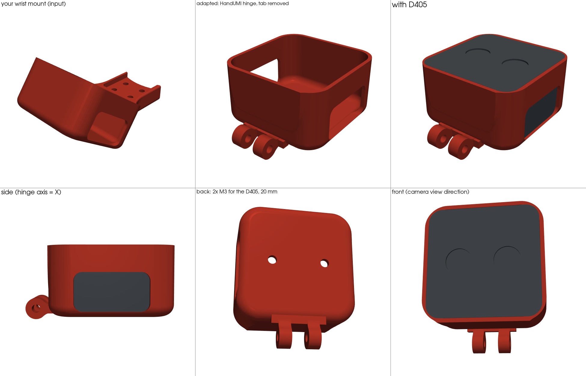
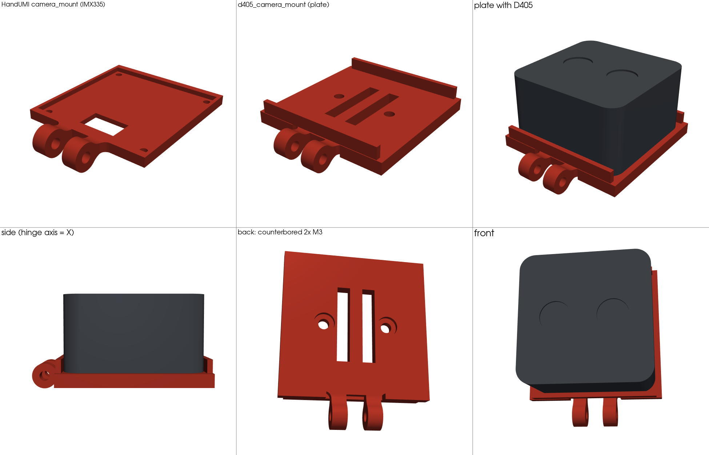

# The UMI no one wants

[HandUMI](https://github.com/murobotics-ai/handumi-hw) with one change: the wrist camera is an
**Intel RealSense D405** instead of the IMX335 USB camera.

## Build

1. Print everything in `hardware/STL/left_handumi/` and/or `hardware/STL/right_handumi/`, **except `camera_mount.stl`**.
2. Print `hardware/STL/d405/wrist_d405_mount_handumi.stl` instead (same part for left and right; one per HandUMI).
3. Print the gripper tips for your robot from `hardware/STL/gripper_tips/`.
4. Follow the HandUMI [BOM](bom/README.md), with the camera changes below.

## D405 wrist mount (`wrist_d405_mount_handumi`)

The supplied wrist camera mount (`d405_mount/input/wrist_camera_mount.stl`) is adapted to HandUMI:

- The flat 4× M3 tab (12 × 10 mm pattern) is removed.
- HandUMI's camera hinge (two Ø8 knuckles, M3 pivot) is fused to that edge of the D405 cup. The knuckles are cut unchanged from
  HandUMI's `camera_mount.step`, so it fits the existing `fisheye_camera_main_support`.
- The cup is unchanged: 42.1 mm pocket, 23 mm deep, 2 mm floor, side windows for the cable, 2× M3 for the D405 at 20 mm.
- The cup's built-in 36.7° tilt is gone. The camera angle is now set on the HandUMI hinge, like the original camera.
- Regenerate: `python d405_mount/wrist_mount_to_handumi.py d405_mount/input/wrist_camera_mount.stl`.
- Screws: **2× M3×5** for the D405 in the cup. The 2 mm floor leaves 3 mm of thread; the datasheet maximum is 4 mm, so M3×6 is the limit.

STEP for Onshape: `hardware/STEP/d405/wrist_d405_mount_handumi.step` (faceted, because the input was a mesh).

## Alternative: flat D405 plate (`d405_camera_mount`)

A simpler printed plate on the same hinge, if you don't want the cup.

- **Hinge:** identical to HandUMI's `camera_mount`: two Ø8 knuckles on the same M3 pivot, cut straight from their STEP. It fits the
  existing `fisheye_camera_main_support` with no other changes.
- **Camera:** two **M3×6** screws from the back into the D405's rear holes. Per Intel's datasheet these are 2× M3×0.5, 20 mm apart,
  with 4.0 mm max engagement; M3×6 through the counterbored 4 mm plate gives about 3.5 mm. Top and bottom lips locate the body. The sides are
  open so the USB-C cable can leave either way.
- **Orientation:** the stereo baseline is parallel to the hinge axis, the same as the IMX335 board's horizontal.

| Item | HandUMI | This repo |
|---|---|---|
| Camera | SVPRO IMX335 USB (×1 per unit) | Intel RealSense D405 (×1 per unit) |
| Camera screws | M2 board screws | 2× M3×5 (cup) or 2× M3×6 (plate) per unit |
| Cable | USB-C (camera) | USB-C to USB-A/C, **USB 3** recommended for depth |

## Check before printing a batch

- **Tilt range:** the D405 is 23 mm deep and weighs 58 g, versus a bare board. Print one mount, assemble it on the support, and check the
  camera clears the support across the tilt you want.
- **Pivot:** with a heavier camera, use a nyloc nut on the M3 pivot so the angle holds.

## Files

| Path | What |
|---|---|
| `hardware/` | HandUMI hardware (STEP + STL), unmodified, plus `d405/` |
| `hardware/{STL,STEP}/d405/wrist_d405_mount_handumi.*` | D405 wrist mount on the HandUMI hinge (recommended) |
| `hardware/{STL,STEP}/d405/d405_camera_mount.*` | Flat D405 plate on the HandUMI hinge (alternative) |
| `d405_mount/` | Sources: `wrist_mount_to_handumi.py`, `d405_camera_mount.py`, `render_mounts.py`, and the input mesh |
| `bom/` | HandUMI BOM, unmodified |
| `tools/inspect_step.py` | Prints holes and bosses of a STEP file |

HandUMI is © its authors, Apache-2.0; see [`hardware/NOTICE.md`](hardware/NOTICE.md).
The earlier rack-and-pinion design is kept on the `v0.1-rack-pinion` branch.
