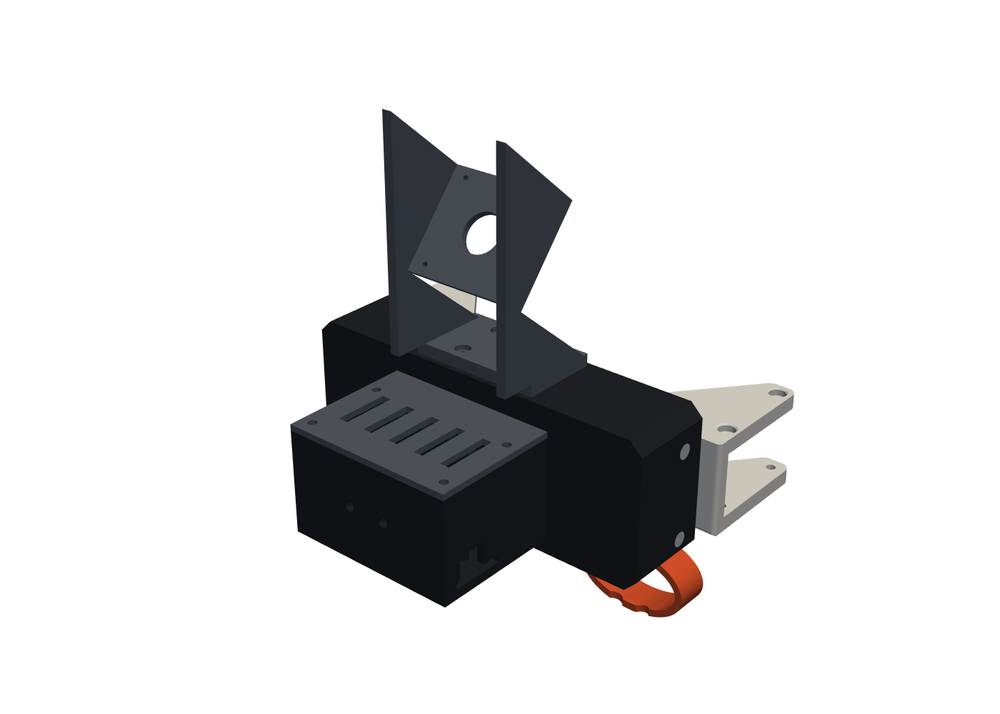
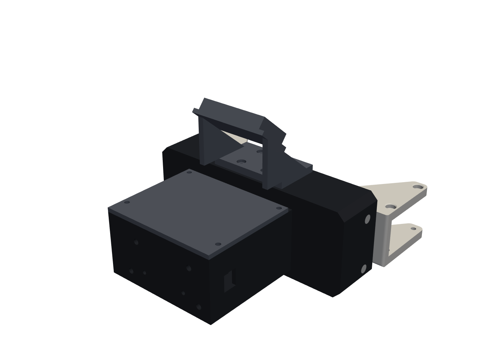

# The UMI no one wants

A hand-worn data collector and a matching OpenArm gripper that share one parallel-jaw module.
It combines [HandUMI](https://github.com/murobotics-ai/handumi-hw) (wearable, swappable tips) with
[YUBI](https://github.com/Toyota/yubi-hw) (magnetic encoder, on-board MCU, OpenArm flange).

| Collector (hand) | OpenArm unit |
|---|---|
|  |  |

- **Rack and pinion jaws**: width is linear in angle (20 mm/rad, 80 mm stroke), and it's the same on the hand and on the robot.
- **HandUMI tips** bolt straight on (4× M2, 8 × 12 mm).
- **Pico + BNO085 + AS5600** in the collector pod. The robot uses an STS3215 on the same pinion.
- **Camera dock**: IMX335 or Intel D405 now, Insta360 later, all with the same viewpoint.
- **OpenArm**: mounts through YUBI's `OPENARM_FLANGE` + `YUBI_ATTACHMENT`.

**Status:** v0.1 CAD, checked geometrically, **not yet printed**. See [`docs/design.md`](docs/design.md)
for the design rationale, the must-verify list and the BOM, and [`cad/README.md`](cad/README.md) to rebuild.

## Layout

```
cad/src/umi/      parametric CAD (build123d)
cad/STEP, STL/    exported parts + assemblies
cad/third_party/  HandUMI tips, YUBI OpenArm flange (unmodified, own licenses)
docs/             design notes, renders
tools/            STEP inspection
```
