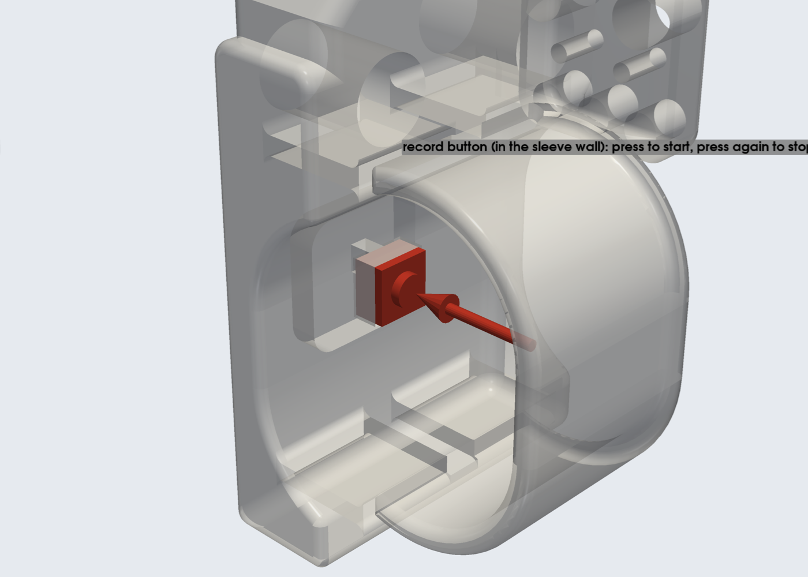
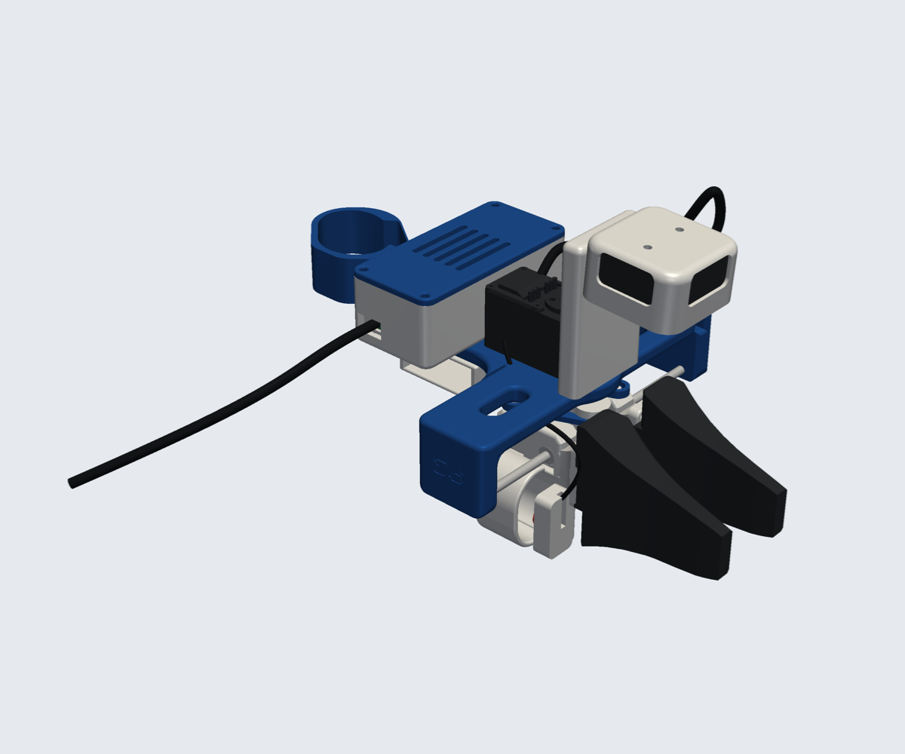
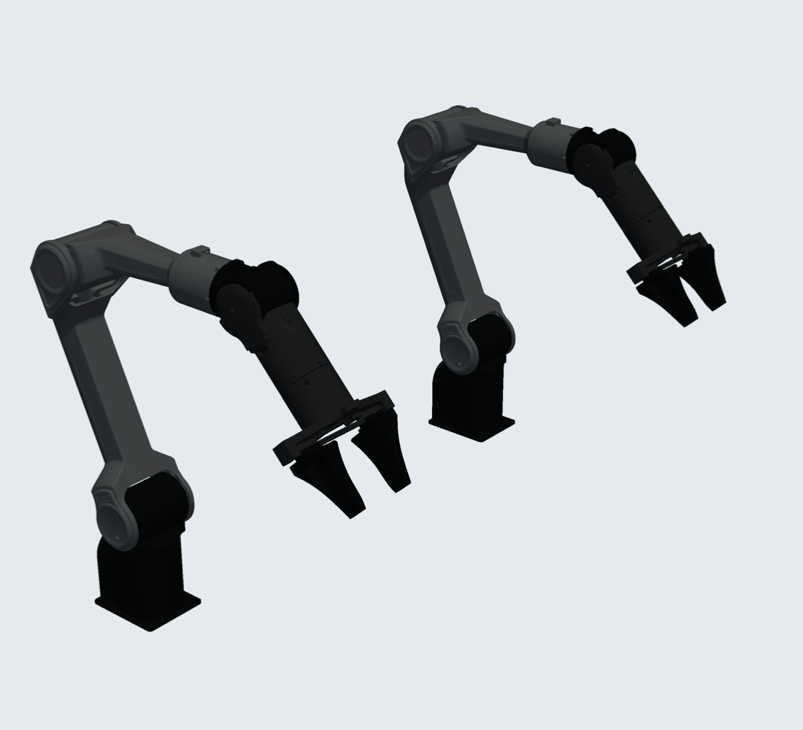
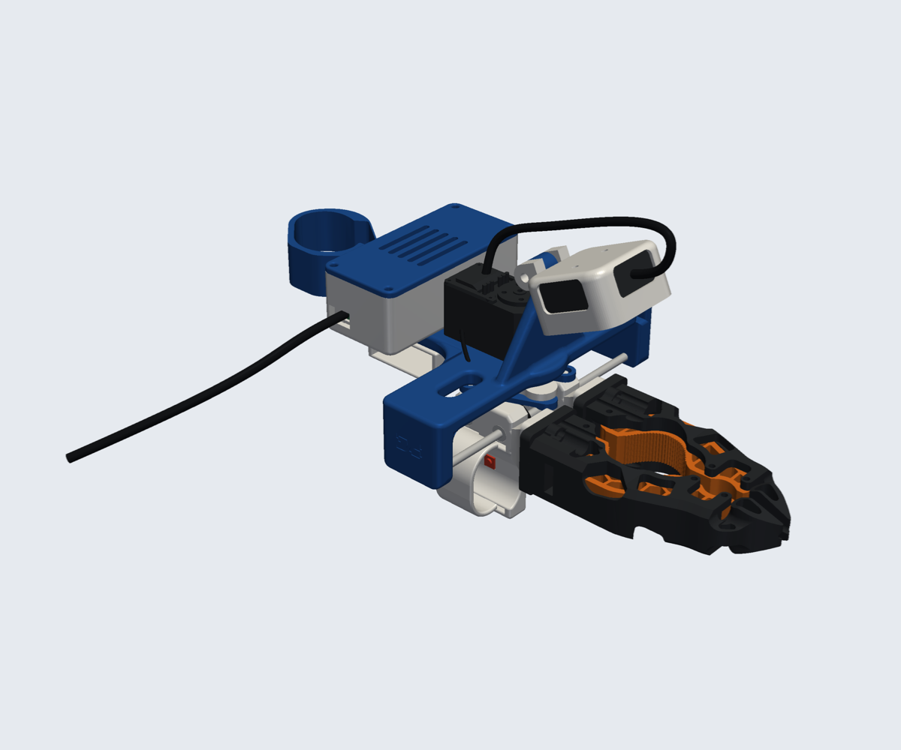
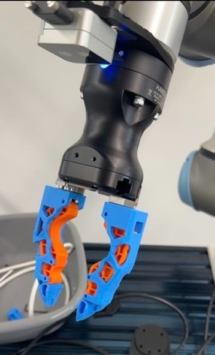
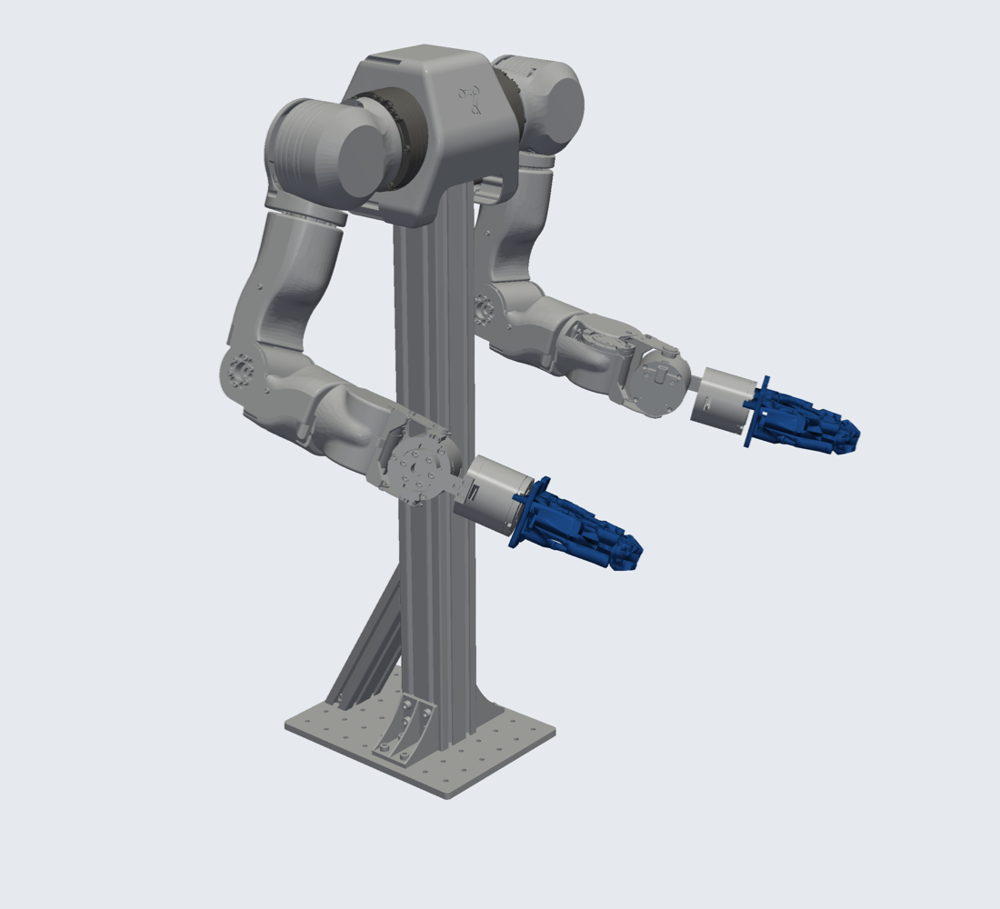

# The UMI no one wants

<p align="center">
  
</p>

A hand-worn gripper for collecting bimanual manipulation data without a robot in the loop. It has an
**Intel RealSense D405** depth camera on the wrist, an on-board **IMU and Raspberry Pi Pico 2**, a **record button** under
your index finger, and a single USB cable to your laptop.

- **Depth wrist camera:** the D405 sits in a cup on a stiff Ø12 / M4 hinge at the end of a braced camera post that flares
  out of the frame. It looks forward and down at the fingers (65° below horizontal, about 9–10 cm away; the D405's minimum
  range is 7 cm). The camera cable leaves from the top window and runs back into the electronics box.
- **Finger sleeves:** each finger link has a sleeve that wraps the finger, so the fingers stay in place while you open and
  close the gripper.
- **Record button:** a 6 × 6 mm tactile switch sits flush in the inner wall of the index-finger sleeve, under the finger
  pad. Press it with your index finger, once to start recording and again to stop. It's wired to the Pico.
- **One cable:** a closed electronics box holds a USB 3 hub, the Pico 2 and the IMU. The camera and the Pico both connect to
  the hub, and one USB-C cable goes to the laptop. See [docs/electronics.md](docs/electronics.md).
- **Universal tip flange:** each finger link has a 20 × 30 mm flange with M2 (8 × 12), M3 (12 × 24 + centre pair) and M4
  (12 mm pair) hole patterns, so you can bolt on tips that match different robot grippers.
- **Moulded look:** every printed part is softly rounded: a blended T-plate outline, rounded slot rims, a concave blend into
  the end wall; the end cover and electronics box match.
- **Checked in a full assembly:** the gripper is clash-checked closed, half-open and fully open.

## Record button

<p align="center">
  
</p>

A 6 × 6 mm tactile switch is set flush into the inner wall of the index-finger sleeve, where the finger pad rests. Press it
with your index finger: **press once to start recording, press again to stop.** It's wired to the Pico (GP15 to ground,
internal pull-up), so the recording software only has to watch one input; see [docs/electronics.md](docs/electronics.md).
That wall is also the one your finger pushes to close the gripper, so use a stiff switch (about 250–320 gf); the
software can tell a deliberate press from a grasp by its duration. The wires leave through the back of the paddle and
run along the frame to the electronics box with a little slack for the finger link's travel.

## Tips for different robots

Swap the tips to match the robot you'll deploy on. The jaws on the device then have the same shape as the robot's fingers.

| Tips on the device | Robot |
|---|---|
|  **AgileX Piper tips** |  **AgileX Piper** |
|  **Open-ENPIRE compliant fingers** |  **Robotiq Hand-E with Open-ENPIRE fingers** |
|  **Open-ENPIRE compliant fingers** |  **OpenArm with Open-ENPIRE fingers** |

The Open-ENPIRE tips are the compliant finger from [Open-ENPIRE-Gripper](https://github.com/pgeedh/Open-ENPIRE-Gripper),
which has matching fingers for OpenArm, Robotiq Hand-E / 2F-140 and I2RT YAM, so the same finger shape is on the device
and on the robot. Here the finger's robot mount is replaced with a plate for the universal flange
(`redesign/enpire_tip.py`); files are in `hardware/STL/gripper_tips/Open-ENPIRE/`. The ENPIRE fingers are about 32 mm
thick, so the two jaws meet (fully closed) when the finger links are ~30 mm apart, a little before the mechanism's own stop.

Robot renders are made with `tools/robots.py` from published open-source robot models (sources in
[`hardware/NOTICE.md`](hardware/NOTICE.md)); the Hand-E photo is from the Open-ENPIRE-Gripper repository.

## Parts

<p align="center">
  
</p>

Print everything in `hardware/STL/right/` for a right hand or `hardware/STL/left/` for a left hand, plus a pair of
tips from `hardware/STL/gripper_tips/`. STEP files for every part are in `hardware/STEP/`.

| Part | File |
|---|---|
| Main support (T-plate with camera post) | `main_support.stl` |
| End cover | `end_cover.stl` |
| D405 wrist mount (cup on the M4 hinge) | `d405_wrist_mount.stl` |
| Electronics box + lid | `electronics_box.stl`, `electronics_lid.stl` |
| Thumb and index/middle finger links (finger sleeve, universal tip flange; record button in the index sleeve) | `*_thumb_link.stl`, `*_index_middle_finger_link.stl` |
| Crank, connecting links, hand support base, controller support | `crank_mechanism_plate.stl`, `connecting_link_1/2.stl`, `hand_support_base.stl`, `*_controller_support.stl` |

### Tip flange hole patterns

| Screws | Pattern | Fixing |
|---|---|---|
| 4× M2 | 8 × 12 mm | Self-tapping (fits every tip in `gripper_tips/`) |
| 6× M3 | 12 × 24 mm rectangle + centre pair at ±12 mm | M3 heat-set inserts (Ø4.0 × 5) |
| 2× M4 | 12 mm apart, centred | M4 heat-set inserts (Ø5.6 × 7) |

## Hardware

Base mechanics, rods, bearings, servo and fasteners are listed in [bom/README.md](bom/README.md), with these changes:

- **Camera:** Intel RealSense D405 instead of the IMX335 camera. Fix it with 2× M3×10 screws through the ridge under the cup into its rear holes (2× M3×0.5, 20 mm apart, 4 mm max thread depth; this leaves 3.5 mm of thread).
- **Camera hinge:** 1× M4×30 bolt with a nyloc nut.
- **Record button:** 1× 6 × 6 mm tactile switch (stiff, ~250–320 gf), and ~30 cm of thin, flexible 2-core wire.
- **Electronics:** Raspberry Pi Pico 2, a BNO085 IMU, a small USB 3 hub and short cables. This replaces the servo controller board and its power supply. Full list and wiring: [docs/electronics.md](docs/electronics.md).

## Files

| Path | What |
|---|---|
| `hardware/STL`, `hardware/STEP` | Printable parts and CAD |
| `redesign/` | Sources: `restyle.py` (main support, end cover, finger links, box), `electronics_box.py`, `finger_link.py`, `hinge.py`, `logo.py`; the starting parts are in `redesign/source/` |
| `d405_mount/` | Source for the D405 wrist mount and its input mesh |
| `tools/assembly.py` | Builds the full assembly, clash-checks it (`--check`) and renders it |
| `tools/render_docs.py` | Renders the images in this README |
| `tools/tips.py`, `tools/robots.py` | Tip fitting on the flange; robot renders |
| `tools/fea.py` | Strength analysis of every printed part (results in `docs/fea_results.csv`, stress maps in `docs/img/fea/`) |
| `docs/electronics.md` | Electronics, wiring and power |
| `bom/` | Bill of materials for the base mechanics |

To rebuild everything (Python 3.12 with `build123d`, `trimesh`, `manifold3d`, `pyvista`):

```bash
python redesign/restyle.py
python d405_mount/d405_wrist_mount.py d405_mount/input/wrist_camera_mount.stl
cd tools && python assembly.py --opening 0 --check && python render_docs.py
```

## Strength

Every printed part is analysed in `tools/fea.py`: linear-elastic FEA in PLA (E = 3 GPa), with quadratic tetrahedra
meshed from the STEP files and checked against hand calculations. Load cases are 15 g knocks on the camera, a 30 N
grip with the tip's 70 mm lever, a 40 N finger press, and hand and VR-controller loads. Safety factors are against
30 MPa (along layers) and 15 MPa (across layers). Results are in [`docs/fea_results.csv`](docs/fea_results.csv), with stress maps in `docs/img/fea/`.

| Part | Load case | Safety factor (along / across layers) |
|---|---|---|
| Main support | camera knock, 15 g (vertical / sideways / fore-aft) | 29 / 14, 20 / 10, 17 / 8 |
| Main support | grip push on the rods, 2 × 30 N, end wall only (conservative) | 3.4 / 1.7 |
| Finger link | 30 N grip on the tip, 70 mm lever | 5.5 / 2.7 |
| Crank plate | 30 N on each crank pin | 52 / 26 |
| Connecting link | 40 N pull | 65 / 32 |

The D405 mount, end cover, electronics box and lid, hand support base and controller support have load cases set up in
`tools/fea.py` but weren't run (`python tools/fea.py d405 end_cover electronics hand_support controller`).

## Grip force

The device records jaw opening (the servo's encoder), IMU motion and the depth camera. It does **not** measure grip
force yet: the servo only runs as an encoder with its torque off, so its load reading isn't meaningful. Thin-film force
sensors under the tips, read by the Pico's analog inputs, are the planned way to add it.

## References

UMI pioneered in-the-wild data collection without a robot in the loop, and YUBI brought that idea to a finger-driven
V-shaped gripper. Generalist built a proprietary hand-worn device for a V-shaped gripper too. This project is an
open-source hand-worn device for robot arms with parallel-jaw grippers.

- Cheng Chi, Zhenjia Xu, Chuer Pan, Eric Cousineau, Benjamin Burchfiel, Siyuan Feng, Russ Tedrake, and Shuran Song.
  "Universal Manipulation Interface: In-The-Wild Robot Teaching Without In-The-Wild Robots." *Robotics: Science and
  Systems (RSS)*, 2024. https://umi-gripper.github.io/
- Takehiko Ohkawa, Jumpei Arima, Yuki Noguchi, et al. "YUBI: Yielding Universal Bidigital Interface for Bimanual
  Dexterous Manipulation at Scale." arXiv:2606.10244, 2026. https://yubi.airoa.io/

## License

Third-party sources, licenses and the list of modifications are in [`hardware/NOTICE.md`](hardware/NOTICE.md).
