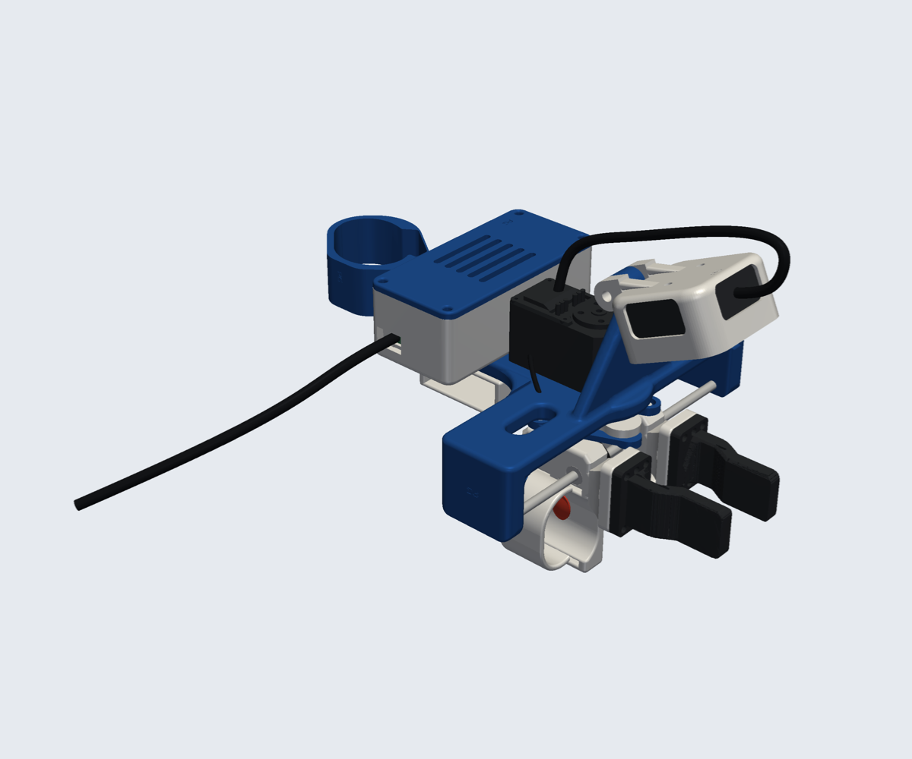
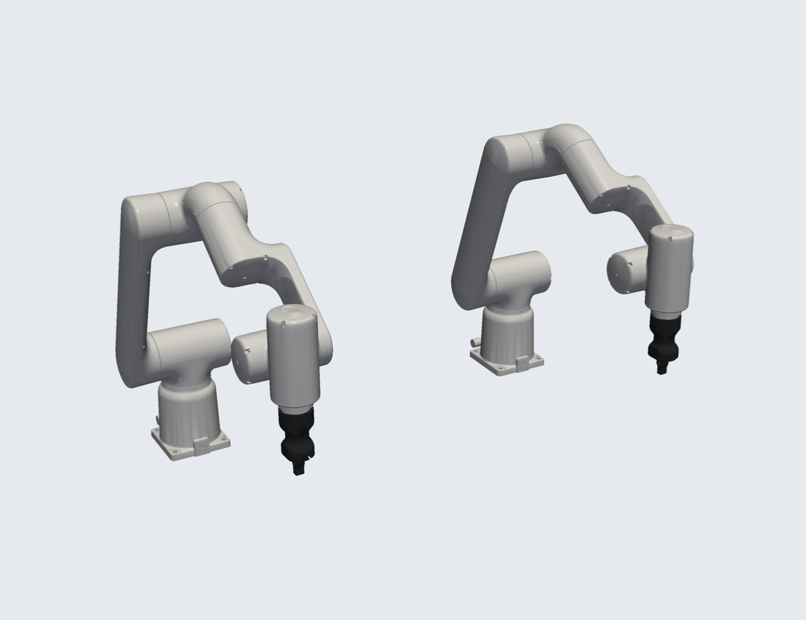
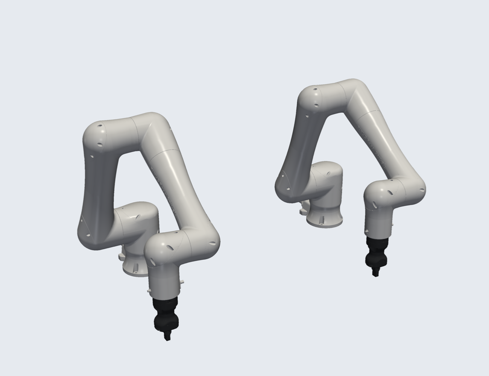
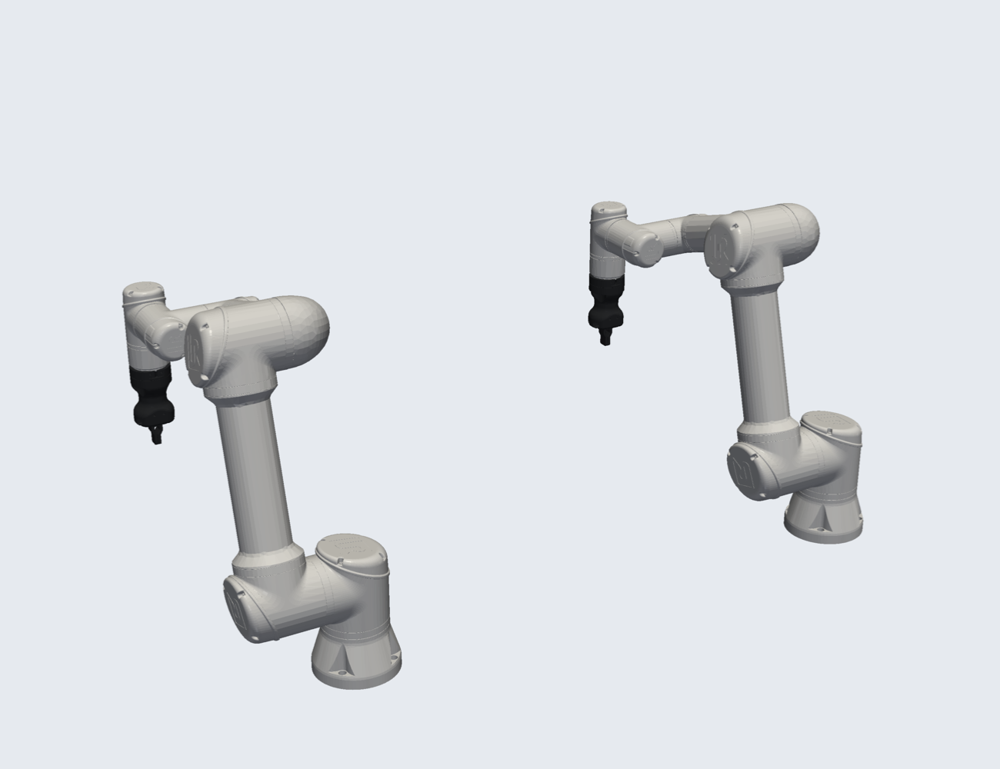

# The UMI no one wants

<p align="center">
  
</p>

A hand-worn gripper for collecting bimanual manipulation data without a robot in the loop. It has an
**Intel RealSense D405** depth camera on the wrist, an on-board **IMU and Raspberry Pi Pico 2**, a **record button** under
your index finger, and a single USB cable to your laptop.

- **Depth wrist camera:** the D405 sits in a cup on a stiff Ø12 / M4 hinge at the end of a braced camera post that flares
  out of the frame; triangulated gussets tie both hinge lugs into the cup. It looks forward and down at the fingers (65° below horizontal, about 9–10 cm away; the D405's minimum
  range is 7 cm). The camera cable leaves from the top window and runs back into the electronics box.
- **Finger sleeves:** each finger link has a sleeve that wraps the finger, so the fingers stay in place while you open and
  close the gripper.
- **Record button:** a 6 × 6 mm tactile switch sits in the inner wall of the index-finger sleeve under a soft, domed
  TPU pad where your finger pad rests. Press it with your index finger, once to start recording and again to stop. It's wired to the Pico.
- **One cable:** a closed electronics box holds a USB 3 hub, the Pico 2 and the IMU. The camera and the Pico both connect to
  the hub, and one USB-C cable goes to the laptop. See [docs/electronics.md](docs/electronics.md).
- **Universal tip flange:** each finger link has a 20 × 30 mm flange with M2 (8 × 12), M3 (12 × 24 + centre pair) and M4
  (12 mm pair) hole patterns, so you can bolt on tips that match different robot grippers.
- **Moulded look:** every printed part is softly rounded: a blended T-plate outline, rounded slot rims, a concave blend into
  the end wall; the end cover and electronics box match.
- **Small PG mark:** every printed part has a small PG logo engraved 0.2 mm deep on one visible face, as a subtle
  maker's mark. The gripper tips stay plain.
- **Checked in a full assembly:** the gripper is clash-checked closed, half-open and fully open with both tip sets.

## Record button

<p align="center">
  
</p>

A 6 × 6 mm tactile switch is set into the inner wall of the index-finger sleeve, where the finger pad rests, under a soft
TPU cover: a 12 × 9 mm oval pad with a gentle 0.8 mm dome and rounded rim, so nothing sharp touches your finger, and a nub
underneath that presses the switch. The cover sits in a matching oval recess, and a rounded boss on the outside of the paddle
gives the switch its depth. A cavity behind the switch leaves room for its legs and solder joints and opens at the back
for soldering. Press it with your index finger: **press once to start recording, press again to stop.** It's wired to the Pico (GP15 to ground,
internal pull-up), so the recording software only has to watch one input; see [docs/electronics.md](docs/electronics.md).
That wall is also the one your finger pushes to close the gripper, so use a stiff switch (about 250–320 gf); the
software can tell a deliberate press from a grasp by its duration. The wires leave through the back of the paddle and
run along the frame to the electronics box with a little slack for the finger link's travel.

## Tips for different robots

Swap the tips to match the robot you'll deploy on, so the jaws on the device have the same shape as the robot's fingers.

| Tips on the device | Robot |
|---|---|
|  **Robotiq Hand-E fingers** |  **ABB GoFa CRB 15000 (dual) with Hand-E** |
|  **Robotiq Hand-E fingers** |  **FANUC CRX-5iA (dual) with Hand-E** |
|  **Robotiq Hand-E fingers** |  **UR5 (dual) with Hand-E** |
|  **Open-ENPIRE compliant fingers** |  **Robotiq Hand-E with Open-ENPIRE fingers** |

- **Hand-E tips** (`hardware/STL/gripper_tips/Robotiq-Hand-E/`): the actual Robotiq Hand-E finger on a flange plate
  (`cad/hande_tip.py`). Print it twice; the index jaw is the same part turned 180°, so the stepped fingertips face each other.
- **Open-ENPIRE tips** (`hardware/STL/gripper_tips/Open-ENPIRE/`): the compliant finger from
  [Open-ENPIRE-Gripper](https://github.com/pgeedh/Open-ENPIRE-Gripper) with its robot mount replaced by a flange plate
  (`cad/enpire_tip.py`). The matching robot-side fingers for Robotiq Hand-E, Robotiq 2F-140, OpenArm and I2RT YAM are in
  `Open-ENPIRE/robot/` (mm), so the same finger shape is on the device and on the robot. The ENPIRE fingers are about
  32 mm thick, so the jaws meet a little before the mechanism's own stop.

Robot renders are made with `cad/robots.py` from the robots' published descriptions (sources in
[`hardware/NOTICE.md`](hardware/NOTICE.md)).

## Assembly

The full assembled device (right hand, half open) is in [`assembly/`](assembly/), once per tip set:

| File | Use |
|---|---|
| `umi_right_robotiq-hand-e.glb`, `umi_right_open-enpire.glb` | Coloured, one node per part, metres, Y up; drag into Onshape, Blender or any glTF viewer |
| `umi_right_robotiq-hand-e.stl`, `umi_right_open-enpire.stl` | One merged mesh in mm, Z up |

The left hand is the mirror image. Regenerate with `python cad/export_assembly.py [--opening 0..1]`.

## Parts

<p align="center">
  
</p>

Print everything in `hardware/STL/right/` for a right hand or `hardware/STL/left/` for a left hand, plus a pair of
tips from `hardware/STL/gripper_tips/`. STEP files for every part are in `hardware/STEP/`.

| Part | File |
|---|---|
| Main support (T-plate with camera post) | `main_support.stl` |
| End cover | `end_cover.stl` |
| D405 wrist mount (cup on the M4 hinge) | `d405_wrist_mount.stl` |
| Record-button cover (TPU) | `button_cover_tpu.stl` |
| Electronics box + lid | `electronics_box.stl`, `electronics_lid.stl` |
| Thumb and index/middle finger links (finger sleeve, universal tip flange; record button in the index sleeve) | `*_thumb_link.stl`, `*_index_middle_finger_link.stl` |
| Crank, connecting links, hand support base, controller support | `crank_mechanism_plate.stl`, `connecting_link_1/2.stl`, `hand_support_base.stl`, `*_controller_support.stl` |

### Tip flange hole patterns

| Screws | Pattern | Fixing |
|---|---|---|
| 4× M2 | 8 × 12 mm | Self-tapping (fits every tip in `gripper_tips/`) |
| 6× M3 | 12 × 24 mm rectangle + centre pair at ±12 mm | M3 heat-set inserts (Ø4.0 × 5) |
| 2× M4 | 12 mm apart, centred | M4 heat-set inserts (Ø5.6 × 7) |

## Hardware

Everything to buy is in [docs/bom.md](docs/bom.md). Notes:

- **Camera:** Intel RealSense D405. Fix it with 2× M3×5 screws into its rear holes (2× M3×0.5, 20 mm apart, 4 mm max thread depth).
- **Camera hinge:** 1× M4×30 bolt with a nyloc nut.
- **Record button:** 1× 6 × 6 mm tactile switch (stiff, ~250–320 gf), ~30 cm of thin, flexible 2-core wire, and the
  `button_cover_tpu.stl` cover printed in TPU 95A.
- **Electronics:** Raspberry Pi Pico 2, a BNO085 IMU, a small USB 3 hub and short cables. No separate servo controller or power supply. Full list and wiring: [docs/electronics.md](docs/electronics.md).

## Files

| Path | What |
|---|---|
| `hardware/STL`, `hardware/STEP` | Printable parts (`right/`, `left/`, `gripper_tips/`) and CAD |
| `assembly/` | Full assembly as GLB and STL |
| `cad/` | Everything that builds the parts: `restyle.py` (main support, end cover, finger links, box), `finger_link.py`, `electronics_box.py`, `hinge.py`, `d405_wrist_mount.py`, `hande_tip.py`, `enpire_tip.py`, `watermark.py`, `logo.py`; inputs in `cad/source/` |
| `cad/assembly.py`, `cad/tips.py` | Full assembly with clash check (`--check`); tip fitting on the flange |
| `cad/export_assembly.py`, `cad/render_docs.py`, `cad/robots.py` | Assembly export, README images, robot renders |
| `cad/fea.py` | Strength analysis (results in `docs/fea_results.csv`, stress maps in `docs/img/fea/`) |
| `docs/bom.md`, `docs/electronics.md` | Bill of materials; electronics, wiring and power |

To rebuild everything (Python 3.12 with `build123d`, `trimesh`, `manifold3d`, `pyvista`), run in this order from `cad/`;
`watermark.py` goes last because it engraves the parts the others write:

```bash
cd cad
python restyle.py && python hande_tip.py && python enpire_tip.py && python d405_wrist_mount.py && python watermark.py
python assembly.py --opening 0 --check && python export_assembly.py && python render_docs.py
python robots.py /path/to/Neuracore_Robots
```

## Strength

Every printed part is analysed in `cad/fea.py`: linear-elastic FEA in PLA (E = 3 GPa), with quadratic tetrahedra
meshed from the STEP files and checked against hand calculations. Load cases are 15 g knocks on the camera, a 30 N
grip with the tip's 70 mm lever, a 40 N finger press, and hand and VR-controller loads. Safety factors are against
30 MPa (along layers) and 15 MPa (across layers). Results are in [`docs/fea_results.csv`](docs/fea_results.csv), with stress maps in `docs/img/fea/`.

| Part | Load case | Safety factor (along / across layers) |
|---|---|---|
| Main support | camera knock, 15 g (vertical / sideways / fore-aft) | 29 / 14, 20 / 10, 17 / 8 |
| Main support | grip push on the rods, 2 × 30 N, end wall only (conservative) | 3.4 / 1.7 |
| Finger link | 30 N grip on the tip, 70 mm lever | 5.5 / 2.7 |
| Crank plate | 30 N on each crank pin | 52 / 26 |
| Connecting link | 40 N pull | 65 / 32 |

The D405 mount, end cover, electronics box and lid, hand support base and controller support have load cases set up in
`cad/fea.py` but weren't run (`python cad/fea.py d405 end_cover electronics hand_support controller`).

## Grip force

The device records jaw opening (the servo's encoder), IMU motion and the depth camera. It does **not** measure grip
force yet: the servo only runs as an encoder with its torque off, so its load reading isn't meaningful. Thin-film force
sensors under the tips, read by the Pico's analog inputs, are the planned way to add it.

## References

UMI pioneered in-the-wild data collection without a robot in the loop, and YUBI brought that idea to a finger-driven
V-shaped gripper. Generalist built a proprietary hand-worn device for a V-shaped gripper too. This project is an
open-source hand-worn device for robot arms with parallel-jaw grippers.

- Cheng Chi, Zhenjia Xu, Chuer Pan, Eric Cousineau, Benjamin Burchfiel, Siyuan Feng, Russ Tedrake, and Shuran Song.
  "Universal Manipulation Interface: In-The-Wild Robot Teaching Without In-The-Wild Robots." *Robotics: Science and
  Systems (RSS)*, 2024. https://umi-gripper.github.io/
- Takehiko Ohkawa, Jumpei Arima, Yuki Noguchi, et al. "YUBI: Yielding Universal Bidigital Interface for Bimanual
  Dexterous Manipulation at Scale." arXiv:2606.10244, 2026. https://yubi.airoa.io/

## License

Third-party sources, licenses and the list of modifications are in [`hardware/NOTICE.md`](hardware/NOTICE.md).
