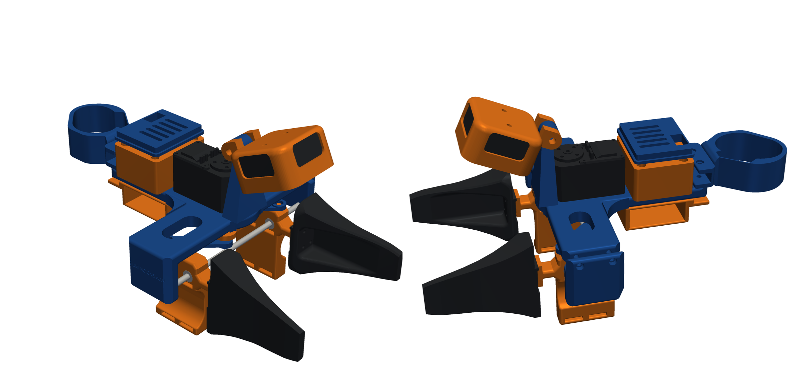
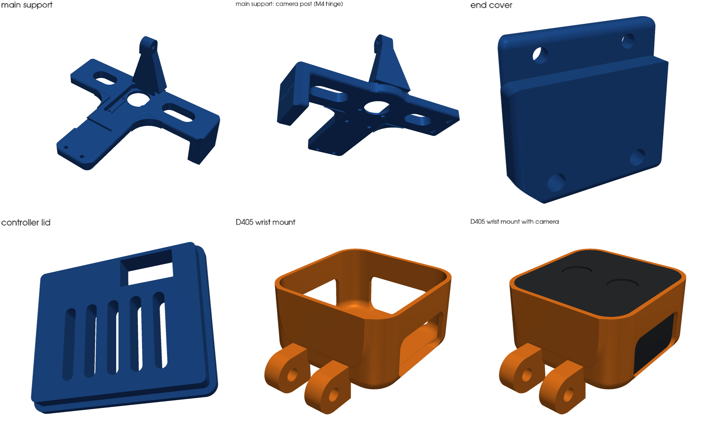

# The UMI no one wants

<p align="center">
  
</p>

A hand-worn UMI for collecting bimanual manipulation data without a robot in the loop. It's built on the
[HandUMI](https://github.com/murobotics-ai/handumi-hw) mechanism, with an **Intel RealSense D405** depth camera on the wrist
and a redesigned frame.

- **Depth wrist camera:** the D405 sits in a cup that tilts on a Ø12 / M4 hinge and looks down at the fingertips. It's set at 65° below horizontal and 9–10 cm from the tips, beyond the D405's 7 cm minimum range. Cable windows are on the top and both sides.
- **Stiff camera post:** a tapered fin on the main support carries the camera hinge.
- **Clean frame:** blended T-plate with lightening slots and faceted ends, plus a matching end cover and a vented controller lid.
- **Checked in a full assembly:** every part is placed from its mating features, and the moving gripper is clash-checked closed, half-open and open, across camera tilts from 40° to 80°.

## Parts

<p align="center">
  
</p>

| Part | File | Qty per hand |
|---|---|---|
| Main support (T-plate with camera post) | `hardware/STL/redesign/main_support.stl` | 1 |
| End cover | `hardware/STL/redesign/end_cover.stl` | 1 |
| Controller lid | `hardware/STL/redesign/controller_lid.stl` | 1 |
| D405 wrist mount | `hardware/STL/d405/wrist_d405_mount_handumi.stl` | 1 |
| Finger links, crank, connecting links, hand support base, controller support, servo-controller box | `hardware/STL/right_handumi/` or `left_handumi/` (HandUMI) | 1 each |
| Gripper tips for your robot | `hardware/STL/gripper_tips/` | 1 pair |

Don't print HandUMI's `fisheye_camera_main_support`, `main_support_cover_plate`, `servo_controller_cover` or `camera_mount`;
the parts above replace them. All the redesigned parts are the same for left and right hands.

## Hardware

HandUMI's [BOM](bom/README.md) applies, with these changes:

- **Camera:** Intel RealSense D405 with a USB 3 cable, instead of the IMX335.
- **Camera screws:** 2× M3×5 into the D405's rear holes (2× M3×0.5, 20 mm apart, 4 mm max thread depth).
- **Camera hinge:** 1× M4×30 bolt and nyloc nut.

## Files

| Path | What |
|---|---|
| `hardware/STL`, `hardware/STEP` | Printable parts and CAD (`redesign/`, `d405/`, plus HandUMI's parts and tips) |
| `redesign/` | Source for the main support, end cover and lid (`restyle.py`) and the shared hinge dimensions (`hinge.py`) |
| `d405_mount/` | Source for the D405 wrist mount and its input mesh |
| `tools/assembly.py` | Builds the full assembly, clash-checks it (`--check`) and renders it |
| `tools/render_docs.py` | Renders the images in this README |
| `bom/` | Bill of materials |

To rebuild everything (Python 3.12 with `build123d`, `trimesh`, `manifold3d`, `pyvista`):

```bash
python redesign/restyle.py
python d405_mount/wrist_mount_to_handumi.py d405_mount/input/wrist_camera_mount.stl
cd tools && python assembly.py --opening 0 --check && python render_docs.py
```

## Credits

Built on [HandUMI](https://github.com/murobotics-ai/handumi-hw) (Apache-2.0); see [`hardware/NOTICE.md`](hardware/NOTICE.md).
The STS3215 servo model used in renders is from [SO-ARM100](https://github.com/TheRobotStudio/SO-ARM100) (Apache-2.0).
