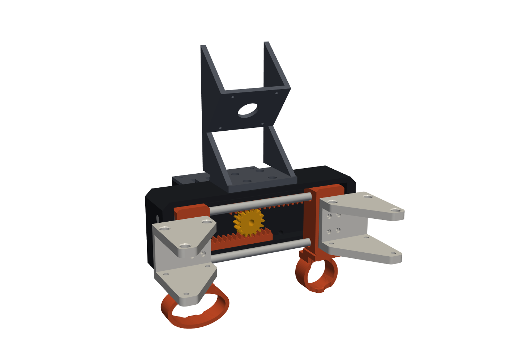

# Design v0.1

A hand-worn, HandUMI-style collector and a matching OpenArm gripper built around one shared
parallel-jaw module. Hardware only; the software side comes later.



## What came from where

| Source | Taken | Changed |
|---|---|---|
| [HandUMI](https://github.com/murobotics-ai/handumi-hw) | Hand-worn form (thumb + index/middle rings), parallel jaws on linear bearings, swappable tips, VR-controller tracking | Crank + links replaced by **rack and pinion**; Ø4 → **Ø6 rods** (≈5× stiffer); one ambidextrous device instead of L/R bodies |
| [YUBI](https://github.com/Toyota/yubi-hw) | Magnetic angle encoder on the finger axis (AS5601 → **AS5600**), on-board MCU, `OPENARM_FLANGE` + `YUBI_ATTACHMENT` | MCU is a **Raspberry Pi Pico** with a **BNO085 IMU** |
| New | Same jaw module on the hand and on the robot, a swappable camera dock (IMX335 / **Intel D405** / Insta360 later) | |

## Why rack and pinion

HandUMI drives its jaws through a crank, so width vs. angle is nonlinear and the jaws are only
synchronised through two links. Here both carriages mesh with one pinion:

```
width = width_closed + 2 · r · θ       r = 10 mm  →  20 mm per radian, 80 mm over 229°
```

The collector reads θ with an AS5600 on the pinion shaft. The OpenArm unit drives the same
pinion with an STS3215 and reads θ from the servo's own encoder. **The same formula and the
same calibration hold on both**, which is what makes retargeting trivial: the recorded width is
the commanded width.

## Layout (frame: X = jaw travel, Y = toward the tips, Z = up)

```
             camera dock (4x M3, 20x20)   <- IMX335 mast | D405 cradle | Insta360 (later)
   ┌──────────────── frame (top plate) ────────────────┐
   │ end  [carriage]==rods==(pinion)==rods==[carriage]  end │  -> tips bolt on the +Y faces
   └──────── back plate + 2x 685ZZ boss ───────────────┘
                 rear-module interface (4x M3)
        collector: pod (AS5600, Pico, BNO085, VR-controller mount)
        OpenArm:   STS3215 cradle -> YUBI_ATTACHMENT -> OPENARM_FLANGE
```

- **Carriages** are one part printed twice; the second is rotated 180° about Y so its rack sits
  under the pinion.
- **Finger rings** are staggered in Y (thumb further back) so they pass each other at full
  close. Swap the thumb/index rings between carriages to change hands.
- **Tips**: the carriage face has HandUMI's 4× M2, 8 × 12 mm pattern, so every tip in
  `cad/third_party/handumi_gripper_tips` bolts on. The UMI-Gripper holders were checked in CAD
  across the full stroke with no interference.
- **Camera**: every adapter puts the optical centre at the same point (`CAM_CENTER`, pitched
  `CAM_TILT` = 40° down), so swapping cameras doesn't move the viewpoint. The collector and the
  robot use the same dock, so the wrist view matches.

## Checks run (`python -m umi.check`, `python -m umi.build`)

- Pinion vs. both racks, frame vs. carriages, carriage vs. carriage at 6 points over the
  80 mm stroke: no interference (0.3 mm backlash on the racks).
- Full collector and OpenArm assemblies at 0 and 80 mm: no interference between any parts
  (servo modelled as its measured envelope).
- Every exported part is a single valid solid.

These checks are geometric only. Nothing has been printed yet.

## Must verify before a print run

| Item | Why | Where |
|---|---|---|
| `YUBI_ATTACHMENT` face and clocking | Hole pattern measured from STEP; which face mates and the rotation about the wrist axis are unconfirmed | `params.YUBI_M3`, `robot.cradle` |
| STS3215 horn pattern + thickness | Horn not in the reference model | `params.HORN_*`, `robot.HORN_T` |
| D405 1/4-20 location | Assumed centred on the base; Intel drawing not checked | `cameras.d405_cradle` |
| IMX335 lens opening | Board pattern taken from HandUMI's mount; lens Ø assumed | `params.IMX335_LENS` |
| BNO085 / AS5600 board outlines | Sellers disagree; pockets are oversize, fix with glue or a clip | `params.IMU_POCKET`, `ENC_POCKET` |
| Heat-set insert hole Ø | Brand dependent | `params.M3_INSERT_D` |
| LM6UU press fit, rod press fit | Printer dependent | `params.PRESS` |
| Ring sizes and positions | Fit to your hand | `params.THUMB_ID`, `INDEX_ID`, `*_RING_Y` |
| VR controller mount | 2× M3 at 16 mm assumed to match HandUMI's `*_controller_support` | `collector.pod` |

## BOM (per unit)

| Part | Collector | OpenArm unit |
|---|---|---|
| Ø6 × 152 mm ground steel rod | 2 | 2 |
| LM6UU linear bearing | 4 | 4 |
| Ø5 D-shaft (40 mm collector / 50 mm robot) | 1 | 1 |
| 685ZZ bearing (5 × 11 × 5) | 2 | 2 |
| M3 heat-set inserts | 16 | 20 |
| M3 screws (8–12 mm) | ~16 | ~20 |
| M2 × 8 screws + nuts (tips) | 8 | 8 |
| Raspberry Pi Pico / Pico 2 | 1 | optional |
| BNO085 IMU breakout | 1 | — |
| AS5600 breakout + 6 × 2.5 mm diametric magnet | 1 | — |
| Feetech STS3215 + bus adapter | — | 1 |
| Camera: SVPRO IMX335 or Intel RealSense D405 | 1 | 1 (same as collector) |
| HandUMI tips (any set) | 1 pair | 1 pair |
| `OPENARM_FLANGE` + `YUBI_ATTACHMENT` (YUBI) | — | 1 each |
| VR controller + HandUMI `*_controller_support` | 1 | — |
| 20 mm hook-and-loop strap | 1 | — |

## Next

- Styling pass (make it look less like a box).
- Print and fit-check the jaw module first (frame, 2 carriages, pinion), then the rest.
- Insta360 camera adapter on the same dock, keeping the rest unchanged.
